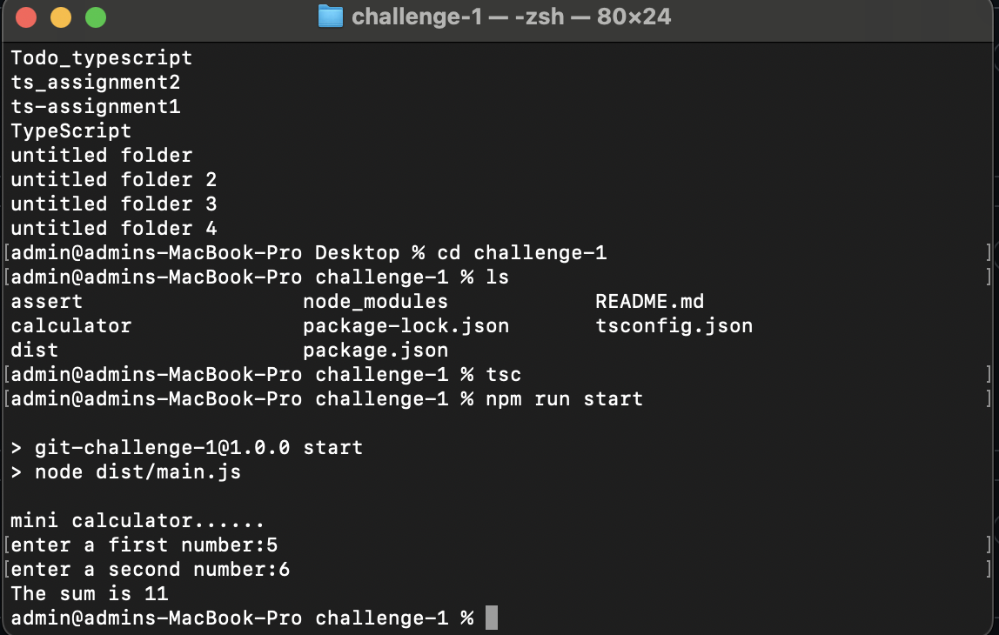

# Calculator
---
## Description
A simple calculator application built with **TypeScript**, starting with basic **addition functionality**. This project is structured for easy expansion to include more operations like subtraction, multiplication, and division.

---

## Table Of Content
- [Calculator](#calculator)
  - [Description](#description)
  - [Table Of Content](#table-of-content)
  - [Project Structure](#project-structure)
  - [Features](#features)
  - [Tech Stack](#tech-stack)
  - [Installation  \& Setup](#installation---setup)
  - [Contributing](#contributing)
  - [Contact](#contact)
  - [Sample Output](#sample-output)
---
## Project Structure
- Challenge-1
  - calculator         
    - main.ts   
  - dist                
  - package.json
  - tsconfig.json
  - README.md

---
## Features
- Developed with **TypeScript** for type safety and maintainability.
- Accepts user input using (`prompt-sync`).
- Performs accurate addition of multiple numbers.
- Displays results clearly in the terminal.


---

## Tech Stack
- TypeScript
- Node.js


---

## Installation  & Setup
1. Clone the Repository
```bash
 https://github.com/SowmyaT-157/mini-calculator-ts  
 ```

2. Click the link to install - [Node.js](https://nodejs.org/) 

3. Install dependencies 
```bash
 npm install
 ```
4. To compile the project 
```bash
tsc
```
5. To run the project 
```bash
 npm run start
 ```

---
## Contributing

1 Fork the repository
2. Create a new branch: `git checkout -b feature/your-feature-name`
3. Make your changes and commit them: `git commit -m 'Add some feature'`
4.Push to the branch: `git push origin feature/your-feature-name`
4. give a Pull Request
   
---
## Contact
- If any Queries contact 
```bash 
https://github.com/SowmyaT-157
```
---
## Sample Output


